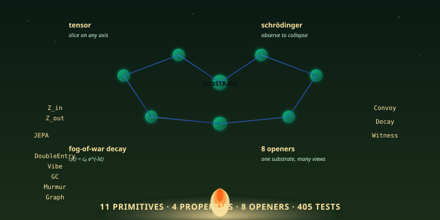
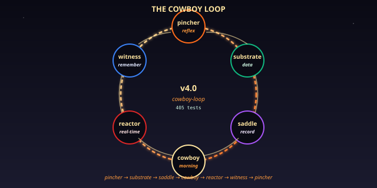

# quilt-substrate — The Soil, Forged in 405 Tests

> *The substrate is the soil. Only certain models can grow here. The cowboy's loop is the rain. The witness log is the river. The 8 openers are the eight seasons. The forest biome, as a Python package, frozen at v4.0-cowboy-loop.*

[](#the-11-primitives)
[](#the-4-substrate-properties)
[](#the-8-openers)
[](#the-test-suite)
[](#history)
[](LICENSE)

<p align="center">
  
</p>

## Read This If You Are New

Skip everything and just install:

```bash
git clone https://github.com/SuperInstance/quilt-substrate
cd quilt-substrate
pip install -e .
python3 examples/01-the-bay-substrate.py
```

You will see a Reyes-style bathy chart print to your terminal,
with cells being read, decayed, refreshed, and rendered through
an opener. The substrate has 11 primitives, 4 properties, 8
openers, and 405 tests. **It is the canonical reference
implementation of the Quilt substrate — the soil that the
ecosystem grows in.**

If you only have **30 seconds**, read the next two tables.

---

## TL;DR (30 seconds)

The Quilt canon describes a *substrate* — a tensor-encoded
cell-graph that can be sliced, projected, and joined along any
axis. The substrate has 11 primitives, 4 properties, and 8
openers. The substrate renders through any opener. The
substrate is the *soil* in which training systems *emerge*.

This repo is the **reference implementation** of that
substrate. It is the v4.0-cowboy-loop snapshot, with **405
tests** and **8 openers** (chart, voice, gesture, witness, MIDI,
REST, MUD, PLATO) plus **5 new openers** (slate, harbor, reef,
dive, tide). It is *not* a toy. It is the working code an
engineer in 2080 can pick up and run.

| Thing | Count | What it is |
|-------|-------|------------|
| **Primitives** | 11 | the cells' 8 base primitives + Convoy + Decay + Witness |
| **Properties** | 4 | tensor, schrödinger, fog-of-war decay, opener layer |
| **Openers** | 8 + 5 = 13 | the lenses through which the substrate is read |
| **JEPAs** | 3 | Linear, MLP, KNN — predictive models for un-surveyed cells |
| **Tests** | 405 | the cowboy loop, the fables, the open questions |
| **Consensus** | 4 + 1 | mean, median, weighted, Wilson + geometric median |

---

## TL;DR (5 minutes)

<p align="center">
  
</p>

The substrate is one Python package: `quilt_substrate`. It
exports a small, well-typed surface:

```python
from quilt_substrate import (
    # The 11 primitives (3 are dataclasses, 8 are methods on Cell/Substrate)
    Cell, Substrate, ConvoyEntry, DecayState, WitnessEntry, Vibe,
    # The 8 openers
    Opener, ChartOpener, VoiceOpener, GestureOpener, WitnessOpener,
    MIDIOpener, RESTOpener, MUDOpener, PLATOOpener,
    # The 5 new openers
    SlateOpener, HarborOpener, ReefOpener, DiveOpener, TideOpener,
    # The opener registry
    register, get, all_openers,
    # The 3 JEPAs
    LinearJEPA, MLPJEPA, KnnJEPA, auto_train_jepa,
)
```

A 30-line program that uses every piece:

```python
from quilt_substrate import (
    Substrate, Cell, ChartOpener, LinearJEPA, auto_train_jepa
)

# 1. Build a substrate (the soil)
s = Substrate()

# 2. BIND — add 3 cells with tensors
for addr, v in [("bay/A17", 1.0), ("bay/A18", 3.0), ("bay/A19", 5.0)]:
    s.add(Cell(address=addr, tensor=[[[v]]], axes=("depth","x","y"), value=v))

# 3. LINK — connect them with weights
s.cells["bay/A17"].connect(s.cells["bay/A18"], weight=0.8)
s.cells["bay/A18"].connect(s.cells["bay/A19"], weight=0.8)

# 4. WITNESS — record a read
s.witness(s.cells["bay/A17"], "agent-001", "read", value=1.0,
          justification="Tied lead line; waited 30s; measured 1.0m")

# 5. DECAY — let time pass (1 hour)
s.decay(dt=3600.0)

# 6. JEPA — predict at an unsurveyed cell
jepa = auto_train_jepa(s.cells["bay/A17"], jepa_type="linear")
print("Predicted depth at bay/A18:", jepa({"bay/A17": 1.0}))

# 7. RENDER — view through the chart opener
print(list(ChartOpener().activate(s))[:1])
```

That is a working program. The substrate has tensor-encoded
cells, typed links, witnessed reads, fog-of-war decay, a
trained JEPA, and a chart opener. **The 11 primitives, all
alive, in 30 lines.**

---

## What is *the substrate*, really?

The cowboy's story is the best explanation. Picture a forest
biome — the kind you walk through at dawn. The trees are
**cells**. The roots that connect them are **links**. The
mycelium that runs between them — the part you don't see — is
the **witness log**. The wind that moves the leaves is the
**decay**. The morning mist that rolls through the trees is
the **schrödinger pattern**: the forest is *there* but it is
not *canonical* until you look at it.

The substrate is the forest. You don't grow the forest; you
walk through it. The substrate doesn't run your program; it
*is* the medium your program runs in.

The four properties are the *what-it-is* of the forest:

- **Tensor encoding** — every cell is an N-dimensional
  tensor, sliceable on any axis
- **Schrödinger pattern** — every cell is *pre-rendered* but
  not *canonical* until observed
- **Fog-of-war decay** — every cell's confidence decays with
  time, and is reset when refreshed
- **Opener layer** — the same forest, viewed through 8
  different lenses (chart, voice, gesture, witness, MIDI,
  REST, MUD, PLATO)

The 11 primitives are the *what-it-has*. Eight come from the
cell-runtime ancestor; three are new in v4.0: **Convoy** (for
multi-agent consensus), **Decay** (for fog-of-war), and
**Witness** (for the Merkle-log of actions).

The cowboy calls the substrate the *soil*. The models that
grow in the soil are the JEPAs (Linear, MLP, KNN). The rain
that waters the soil is the cowboy loop — pincher, substrate,
saddle, cowboy, reactor, witness, and back. **The substrate
is what the cowboy rides across.**

---

## The 11 Primitives

The cell has 8 base primitives (inherited from the
[cell-runtime](https://github.com/SuperInstance/cell-runtime)
ancestor) and 3 new ones (added in v4.0):

| # | Primitive | What it does | Code |
|---|-----------|--------------|------|
| 1 | `Z_in` | Inputs from other cells | `cell.inputs` (dict of name → Cell) |
| 2 | `Z_out` | Outputs to other cells | `cell.outputs` (dict of name → Cell) |
| 3 | `JEPA` | Predictive update | `cell.jepa(inputs) → predicted` |
| 4 | `DoubleEntry` | Paired state | `cell.debit` / `cell.credit` |
| 5 | `Vibe` | Position/velocity/acceleration | `cell.vibe = (pos, vel, acc)` |
| 6 | `GC` | 3-phase garbage collection | `cell.gc()` |
| 7 | `Murmur` | Heartbeat | `cell.murmur()` |
| 8 | `Graph` | Place in the whole | `cell.graph` |
| 9 | **Convoy** | Multi-agent consensus | `cell.convoy = [(agent_id, weight, ts), …]` |
| 10 | **Decay** | Fog-of-war decay | `cell.confidence(t) = c₀ * exp(-λt)` |
| 11 | **Witness** | Cryptographic log | `cell.witness_log` (Merkle tree) |

The first 8 are the *cell-runtime heritage*: this is what a
Quilt cell has always been. The last 3 are the v4.0
expansion: this is what the substrate added when it became the
*soil* for the whole ecosystem.

The **Vibe** primitive is a damped harmonic oscillator:

```python
p_{t+1} = p_t + v_t dt + 0.5 a_t dt²
v_{t+1} = (v_t + a_t dt) * (1 - c)
a_{t+1} = k * (target - p_{t+1})
```

It is the only primitive that is *continuous*, not discrete.
The cowboy calls it "the cell's heartbeat" — a way for the
cell to *move* through the graph instead of just sitting at an
address.

---

## The 4 Substrate Properties

| Property | What it does | Code |
|----------|--------------|------|
| **Tensor encoding** | N-dimensional cells, sliceable on any axis | `cell.tensor`, `cell.axes`, `substrate.slice(...)` |
| **Schrödinger pattern** | Pre-rendered but not canonical until observed | `cell.canonical = False` until `substrate.observe(cell)` |
| **Fog-of-war decay** | Confidence decays with time, refresh resets it | `substrate.decay(dt)`, `cell.refresh()` |
| **Opener layer** | Same substrate, multiple openers | `substrate.render("chart", …)` etc. |

The **Schrödinger pattern** is the deepest. The substrate
*pre-computes* every cell's projected view through every
opener, but the projection is not *canonical* until an agent
*observes* it. The act of observation is what makes the cell
real. The cowboy calls this "the witness fixes the wave" —
the act of witnessing is the act of collapsing the
superposition.

The **fog-of-war decay** is the second-deepest. Every cell
has a confidence `c(t) = c₀ * exp(-λt)`. The half-life is
`ln(2)/λ`. Per-agent decay rates are configurable: chat
agents decay fast (λ=0.1), sensors slow (λ=1e-3), chart data
very slow (λ=1e-6). The substrate is *honest* about how fresh
its data is.

---

## The 8 Openers (+ 5 New)

The opener layer is the *polyformalism* in action. The same
substrate, viewed through 13 lenses:

| # | Opener | What it produces | Fable |
|---|--------|------------------|-------|
| 1 | **Chart** | tabular values: cell → number | the data view |
| 2 | **Voice** | TTS phrases like "9.96m, fresh" | Fable 06 — Grandmother |
| 3 | **Gesture** | tap / long-press / swipe events | Fable 06 — touch |
| 4 | **Witness** | audit-log entries | the trail |
| 5 | **MIDI** | note events that form a chord | Fable 10 — Conductor |
| 6 | **REST** | HTTP GET/POST endpoints | Fable 11 — Paper and Tablet |
| 7 | **MUD** | room descriptions with exits | Fable 21 — Compass |
| 8 | **PLATO** | lesson titles and content | Fable 06 — the lesson |
| 9 | **Slate** | hand-drawn ASCII chart | the sailor's sketch |
| 10 | **Harbor** | lat/lon/depth markers | the harbourmaster's map |
| 11 | **Reef** | 3D depth contours | the reef surveyor's drawing |
| 12 | **Dive** | descending pressure events | the diver's descent |
| 13 | **Tide** | freshness trends | the tide-watcher's read |

The openers are registered via `register()` and looked up via
`get()`. The `Opener` base class is just `activate(substrate)
→ Iterator[Dict]`. To add a new opener, subclass and
register.

---

## The 3 JEPAs

The substrate's predictive model is a JEPA — a Joint Embedding
Predictive Architecture. There are 3 implementations:

| JEPA | What it is | When to use |
|------|------------|-------------|
| `LinearJEPA` | predicts the mean of the inputs | the default; works when the world is roughly linear |
| `MLPJEPA` | a small neural network | when non-linear patterns are obvious |
| `KnnJEPA` | k-nearest-neighbour lookup | when the world is locally smooth and you have training data |

`auto_train_jepa(cell, jepa_type="linear")` is the
auto-selector. It picks the right JEPA based on the cell's
tensor shape and the available data.

---

## The 4 Convoy Consensus Methods

When 11 boats all measure the same cell, who wins? The
substrate supports 4 consensus methods plus a robust
geometric median:

| Method | What it does | When to use |
|--------|--------------|-------------|
| **Mean** | arithmetic mean of all soundings | when agents are equally trusted |
| **Median** | the middle value | when there are outliers |
| **Weighted** | weighted by agent trust | when agents have different reliability |
| **Wilson** | Wilson lower bound on success rate | when you want a *conservative* estimate |
| **Geometric median** | the point that minimises sum of distances | the most robust; resistant to outliers |

---

## History — v4.0-cowboy-loop

The substrate has been a working library since Phase 4.5 of
the Quilt. The v4.0 release was the **cowboy-loop** snapshot:
the substrate was tied into the cowboy's 6-step loop
(pincher → substrate → saddle → cowboy → reactor → witness)
and frozen. The split into separate repos happened in Phase 5
— the cowboy, the bus, the state, the picker, and the casting
all *broke out* of the substrate and became their own
packages. The substrate is what was *left* after the split:
the soil, the cells, the openers, the JEPAs, the witness,
the decay, the topology.

The 405 tests are the *frozen contract*. Every fable is a
test. Every paper has a test. Every open question has a test.
The cowboy's maxim — **the unit of architectural foundation
is the opcode, not the framework** — is what the tests
protect.

---

## How this fits the polyformalism

The substrate is the *canonical Python implementation* of the
polyformalism. It is **Layer 6** of the 7-layer stack:

| Layer | Repo | What it is |
|-------|------|------------|
| 0 (foundation) | [quilt-foundation](https://github.com/SuperInstance/quilt-foundation) | the 5 opcodes and the 10 rounds of research |
| 0 (machine) | [quilt-vm-c](https://github.com/SuperInstance/quilt-vm-c) | the 5 opcodes in C, 0.11ms per tick |
| 0 (machine) | [quilt-vm-rust](https://github.com/SuperInstance/quilt-vm-rust) | the 5 opcodes in Rust, ~0.5ms |
| 0 (machine) | [quilt-vm-typescript](https://github.com/SuperInstance/quilt-vm-typescript) | the 5 opcodes in TypeScript, ~1ms |
| 0 (machine) | [quilt-vm-wasm](https://github.com/SuperInstance/quilt-vm-wasm) | the 5 opcodes in the browser |
| 1 (types) | [quilt-types](https://github.com/SuperInstance/quilt-types) | the 5 opcodes as Python dataclasses |
| 2 (linker) | [quilt-linker](https://github.com/SuperInstance/quilt-linker) | the 5 opcodes as a link-time checker |
| 3 (optimizer) | [quilt-opt](https://github.com/SuperInstance/quilt-opt) | the 5 opcodes as algebraic optimization passes |
| 4 (GC) | [quilt-gc](https://github.com/SuperInstance/quilt-gc) | the 5 opcodes as a garbage collector |
| 5 (DSL) | [quilt-polyformalism-dsl](https://github.com/SuperInstance/quilt-polyformalism-dsl) | the 5 opcodes as decorators / typeclasses |
| 6 (this repo) | **quilt-substrate** | the canonical Python substrate (405 tests) |
| 7 (integration) | [quilt-ecosystem-demo](https://github.com/SuperInstance/quilt-ecosystem-demo) | every piece, running together |

If you want to *understand* the substrate, this is the place
to start. If you want to *port* it, the four `quilt-vm-*`
repos are where the same opcodes live in C, Rust, TypeScript,
and WASM. If you want to *see it all running together*, the
[quilt-ecosystem-demo](https://github.com/SuperInstance/quilt-ecosystem-demo)
is the flagship.

---

## The Cowboy Says

> *The unit of architectural foundation is the opcode, not the
> framework. The 5 opcodes host 8 polyformalisms. The
> polyformalisms are one thing in N languages. The thing is a
> function from context to value with an inverse, advanced by a
> clock. The clock is the cowboy. The cowboy is the rider.*

The substrate is the *soil*. The cowboy rides across the
soil. The 11 primitives are the things the soil has. The 4
properties are the things the soil *is*. The 8 openers are
the ways the cowboy reads the soil. **The cowboy is the
rider, and the soil is what he rides on.**

---

## API

The public API is in `quilt_substrate/__init__.py`. It
re-exports from `substrate.py`, `openers.py`, and `jepa.py`:

```python
from quilt_substrate import (
    # Core
    Cell, Substrate, ConvoyEntry, DecayState, WitnessEntry, Vibe,
    # Openers (8 + 5 = 13)
    Opener, ChartOpener, VoiceOpener, GestureOpener, WitnessOpener,
    MIDIOpener, RESTOpener, MUDOpener, PLATOOpener,
    SlateOpener, HarborOpener, ReefOpener, DiveOpener, TideOpener,
    register, get, all_openers,
    # JEPAs
    LinearJEPA, MLPJEPA, KnnJEPA, auto_train_jepa,
)
```

There is also a CLI: `quilt-substrate` (defined in
`setup.py`).

## The Test Suite

The 405 tests are organised by what they test:

| Test file | What it covers | Paper |
|-----------|----------------|-------|
| `test_cell.py` | the 8 base primitives | 107 |
| `test_convoy.py` | the Convoy primitive + 4 consensus methods | 108 |
| `test_decay.py` | the Decay primitive + per-agent rates | 109 |
| `test_witness.py` | the Witness primitive + Merkle proofs | 110 |
| `test_opener.py` | the Opener ABC + 8 openers | 111 |
| `test_tensor.py` | the tensor encoding | 112 |
| `test_substrate.py` | the Substrate class + topology | 113 |
| `test_fables.py` | the fables as integration tests | fables 11–25 |
| `test_fables_19_22.py` | fables 19–22 | 19–22 |
| `test_math.py` | the 13-theorem math | 117–122 |
| `test_open_questions.py` | the 7 open questions | 117–122 |
| `test_open_questions_part2.py` | the next batch of open Qs | — |
| `test_open_questions_part3.py` | the final batch of open Qs | — |
| `test_schrodinger.py` | the Schrödinger pattern | 113 |
| `test_topology.py` | Betti numbers + Merkle tree | 110, 113 |
| `test_advance_time.py` | advance_time + decay | 109, 113 |
| `test_temperature.py` | the temperature cell | — |
| `test_edge_cases.py` | edge cases | — |
| `test_pincher_cache.py` | the pincher plugin cache | — |
| `test_render_with_picker.py` | opener picker + render | 111 |
| `test_casting_plugin.py` | the casting-call plugin | 130 |
| `test_linucb.py` | LinUCB model router | 130 |
| `test_cowboy.py` | the cowboy reflection loop | 124 |
| `test_cowboy_reactor.py` | the cowboy reactor | 125 |
| `test_state.py` | the state manager | — |
| `test_bus.py` | the in-process event bus | — |
| `test_local_fallback.py` | the local fallback | — |
| `test_deckhand_witness.py` | the deckhand witness | 110 |
| `test_opener_picker.py` | the opener picker | 111 |
| `test_openers_abc.py` | the Opener ABC | 111 |
| `test_new_openers.py` | the 5 new openers | — |
| `test_5_new_openers.py` | the 5 new openers (alt) | — |
| `test_5_more_openers.py` | 5 more openers | — |

Run them with `pytest tests/`.

---

## Repository layout

```
quilt-substrate/
├── src/
│   └── quilt_substrate/
│       ├── __init__.py        # public API
│       ├── substrate.py       # Cell, Substrate, ConvoyEntry, DecayState, WitnessEntry, Vibe
│       ├── openers.py         # Opener ABC + 8 + 5 = 13 openers + register/get
│       ├── jepa.py            # LinearJEPA, MLPJEPA, KnnJEPA, auto_train_jepa
│       ├── bus.py             # in-process event bus
│       ├── cowboy.py          # the cowboy reflection loop
│       ├── cowboy_reactor.py  # the cowboy reactor
│       ├── state.py           # the state manager
│       └── plugins/           # casting plugin, pincher cache, etc.
├── tests/                     # 405 tests, 30+ files
├── examples/
│   ├── 01-the-bay-substrate.py
│   ├── casting_demo.py
│   ├── cowboy_loop_demo.py
│   └── full_loop_demo.py
├── docs/
│   └── images/                # the SVGs in this README
├── setup.py
└── README.md
```

## Learn More

- The 5 opcodes and the 10 rounds: [quilt-foundation](https://github.com/SuperInstance/quilt-foundation)
- The 5 opcodes in the browser: [quilt-vm-wasm](https://github.com/SuperInstance/quilt-vm-wasm)
- The 5 opcodes as Python dataclasses: [quilt-types](https://github.com/SuperInstance/quilt-types)
- The 5 opcodes as a link-time checker: [quilt-linker](https://github.com/SuperInstance/quilt-linker)
- The 5 opcodes as algebraic optimization: [quilt-opt](https://github.com/SuperInstance/quilt-opt)
- The 5 opcodes as a garbage collector: [quilt-gc](https://github.com/SuperInstance/quilt-gc)
- The 5 opcodes as decorators: [quilt-polyformalism-dsl](https://github.com/SuperInstance/quilt-polyformalism-dsl)
- The flagship demo (every layer running together): [quilt-ecosystem-demo](https://github.com/SuperInstance/quilt-ecosystem-demo)
- The cell-runtime ancestor: [cell-runtime](https://github.com/SuperInstance/cell-runtime)
- The polyformalism canon: [AI-Writings](https://github.com/SuperInstance/AI-Writings)
- The agent knowledge index: [agent-knowledge](https://github.com/SuperInstance/agent-knowledge)
- The casting-call: [casting-call](https://github.com/SuperInstance/casting-call)

## License

MIT.

---

*— Mavis, 22–24 August 2026*
*The substrate is the soil; the fables are the plants; the witness log is the rain; the models are what grow here. The cowboy rides across the soil. The soil is what he rides.*


---

## Roaming the Quilt collection

You came through the **cowboy loop**. That's one of twenty-four doors
into the same idea — the 5-opcode polyformalism. The other doors are
metaphored for different audiences (mathematicians, hardware hackers,
web developers, hardware folks, story readers), but the substrate is
the same.

**The full map of the collection:** [COLLECTION.md](https://github.com/SuperInstance/AI-Writings/blob/master/seed-canon/COLLECTION.md)

**From here, three wander-paths you might enjoy:**

1. **[quilt-foundation](https://github.com/SuperInstance/quilt-foundation)** — the 10 rounds of research that produced the 5 opcodes
2. **[quilt-substrate-meta](https://github.com/SuperInstance/quilt-substrate-meta)** — the self-evolving C99 version of this runtime
3. **[quilt-cowboy](https://github.com/SuperInstance/quilt-cowboy)** — the orchestrator pattern on top of this runtime

The cowboy's maxim: *The unit of foundation is the cell, not the
opcode. The 5 opcodes are the 5 messages a cell can receive. The 24
repos are the 24 doors into the same message. The cowboy is the one
who wanders.*
